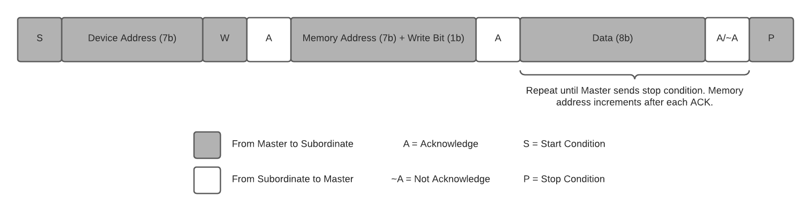
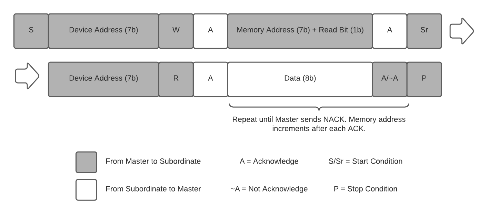
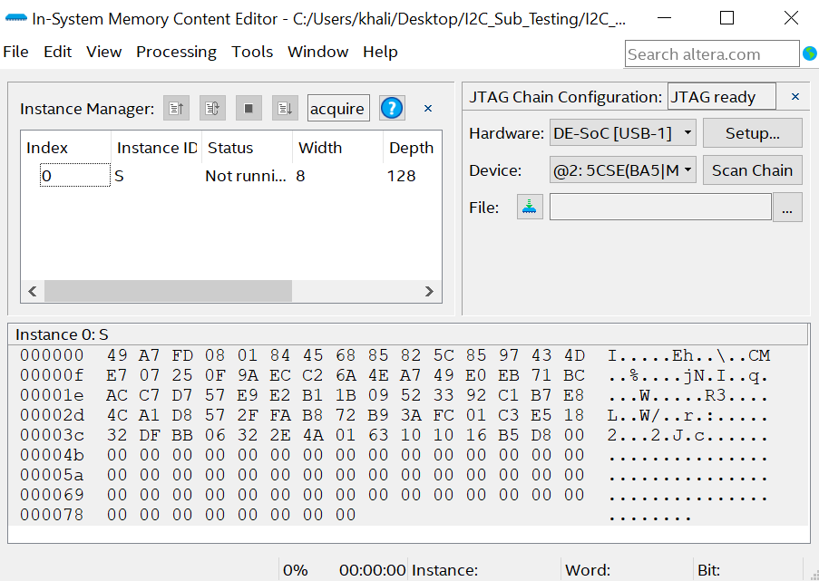
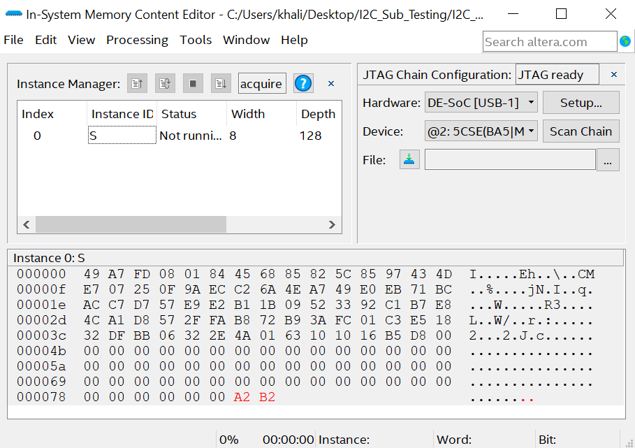
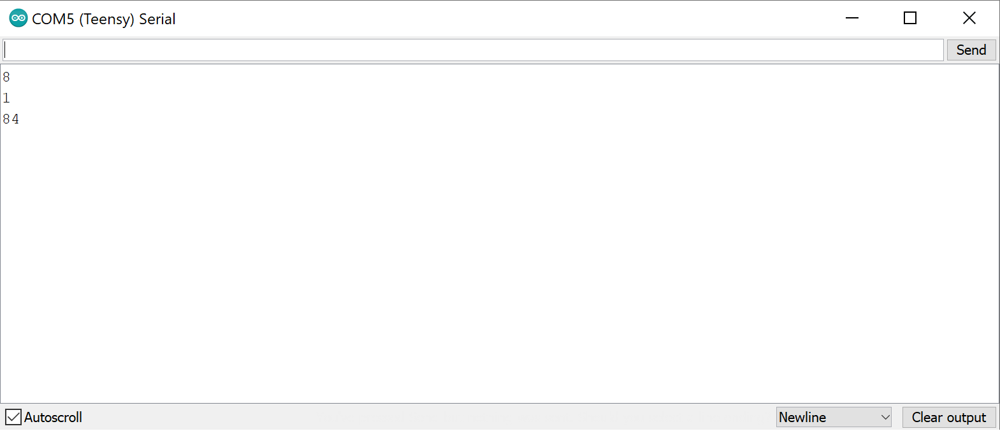
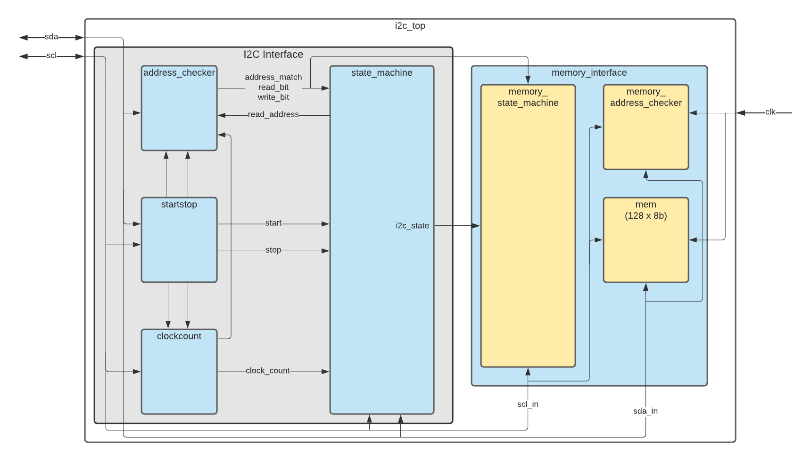
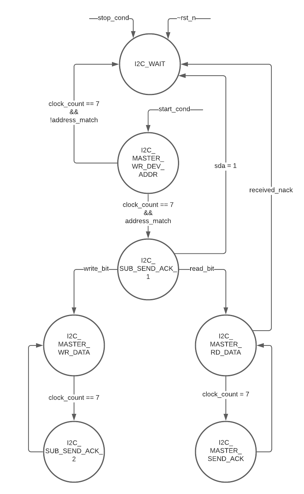
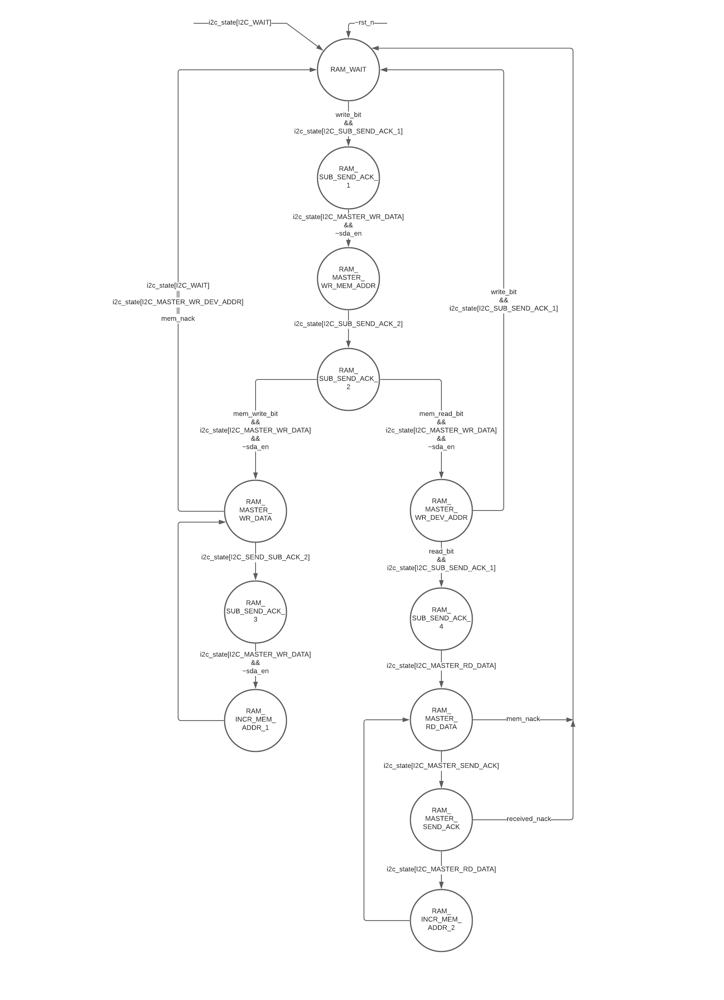

# I2C-Subordinate-Interface

## Table of contents
- [Introduction](#Introduction)
- [Objectives](#Objectives)
- [Device Overview](#Device-Overview)
- [Operation](#Operation)
  - [Write Operation](#Write-Operation)
  - [Read Operation](#Read-Operation)
- [Examples](#Exmaples)
  - [Write to memory example](#Write-to-memory-example)
  - [Read from memory example](#Read-from-memory-example)
- [Diagrams](#Diagrams)
  - [Top Level Block Diagram](#Top-Level-Block-Diagram)
  - [State Machine Diagrams](#State-Machine-Diagrams)

## Introduction

The goal of this project was to design an I2C interface according to the [I2C-bus specification document](UM10204_NXPSemiconductors.pdf). We created a memory interface to communicate over I2C with a master device. The I2C and memory interface was designed in SystemVerilog and implemented on an FPGA. This document will explain the design and specification of the subordinate device and give a couple examples of operation.


## Objectives

- Learn about the I2C standard
- Gain experience designing according to a standard
- Gain experience with SystemVerilog design and verification
- Implement digital design on hardware (FPGA)
- Interface FPGA with external devices


## Device Overview

We gave our device a unique I2C address of 1100110. The memory block was generated by Quartus with a width of 8 bits and depth of 128 entries. Testbenches were created and simulated using ModelSim to verify correct operation. The I2C and memory interface were compiled in Quartus and programmed on a DE1-SoC FPGA for validation. We interfaced the FPGA with an Arduino using the Wire library to act as a master device. Since our FPGA does not contain non-volatile memory, our memory elements are erased after the FPGA is powered off. The state machine diagrams and top level block diagram can be found in the [diagrams](#diagrams) section.


## Operation

### Write Operation
We have two modes of operation, write mode and read mode. During a write operation the master sends data to memory, and during a read operation the master receives data from memory.

As specified in the I2C standard, during a write operation the master initiates the transmission by sending a start condition followed by the device address (7b) and a write bit. The next byte of data sent is the memory address (7b) followed by a write bit. After each byte of data is stored, the memory address is incremented by one. This process repeats until either the master sends a stop condition or the final memory address (0x7F) is reached. In the case where the final memory address is reached, the subordinate device will go to a wait state and the master will received a NACK on the next byte of data.

<p align="center">
  
</p>
<p align="center">
  Write operation
</p>
<p>&nbsp;</p>


<!--  -->

### Read Operation
During a read operation the master initiates the transmission by sending a start condition followed by the device address (7b) and a write bit. The next byte of data sent is the memory address (7b) followed by a read bit. Next the master sends a repeated start condition followed by the device address (7b) and a read bit. The subsequent bytes are read from the specified memory address. After each data byte is received, the memory address is incremented by one until the final memory address is reached. When the final memory address is reached the subordinate device will go to a wait state and the master will receive garbage values for the rest of the transmission if bytes of data were requested beyond the final memory address.  


<p align="center">
  
</p>
<p align="center">
  Read operation
</p>
<p>&nbsp;</p>

<!--  -->


## Examples

We will cover two examples interfacing with our I2C device using an Arduino with the Wire library. We used the Quartus software to program our FPGA and used the in-system memory content editor to view the memory running on our FPGA. We initialized our memory with some random values.

### Write to memory example

This example covers how to write data to memory. We start the transmission and write the device address of '1100110'. We then write the memory address '1111110' (0x7E) followed by a write bit '0'. Next we write the value 0xA2 to memory address 0x7E. The memory address will increment automatically, and we write the value 0xB2 to memory address 0x7F. To demonstrate a corner case, we try to write the value 0xC2 however this action is not valid since we have reached the last memory address 0x7F and the master will receive a NACK.

```C
#include <Wire.h>

void setup() {
  Wire.begin();

  //WRITE
  Wire.beginTransmission(0b1100110);         // Device address bits (7b)
  Wire.write(0b11111100);                    // Memory address (7b) and write bit (1b) (0x7E)
  Wire.write(0xA2);                          // Data to be written to memory location 0x7E
  Wire.write(0xB2);                          // Data to be written to memory location 0x7F
  Wire.write(0xC2);                          // This is a garbage value that shouldn't be written into memory because NACK will be set (address only increments to 0x7F)
  Wire.endTransmission(1);
}
```

<p align="center">
  
</p>
<p align="center">
  Memory contents before write operation
</p>
<p>&nbsp;</p>


<!--  -->


<p align="center">
  
</p>
<p align="center">
  Memory contents after write operation
</p>
<p>&nbsp;</p>


<!--  -->

### Read from memory example

This example covers how to read data from memory. We start the transmission and write the device address '1100110'. We then write the memory address '0000011' (0x03) followed by a read bit '1'. Next we send a repeated start condition and write the device address and specify the number of bytes we want to read using the requestFrom() function. After receiving the specified number of bytes, we read from the buffer on the Arduino and print the result to the serial monitor.

```C
#include <Wire.h>

#define NUM_BYTES 3

void setup() {
  Serial.begin(9600);
  Wire.begin();

  //READ
  Wire.beginTransmission(0b1100110);         // Resend device address after stopping.
  Wire.write(0b00000111);                    // Write memory location (7b) to be read from and read bit (1b)
  Wire.endTransmission(0);                   // Repeat start
  Wire.requestFrom(0b1100110, NUM_BYTES);    // Device address, 3 bytes

  for (int i = 0; i <= NUM_BYTES-1; i++)
  {
    byte x = Wire.read();             
    Serial.println(x,HEX);
  }
}
```


<p align="center">
  
</p>
<p align="center">
  Serial monitor contents after read operation
</p>
<p>&nbsp;</p>

<!--  -->

## Diagrams

### Top Level Block Diagram

The I2C top level module is divided into the I2C interface and the memory interface. The system has been designed so that the memory interface could be replaced by any other suitably designed I2C subordinate device. The I2C interface handles all functionality concerning communication with a master device. 

Note: I2C Interface is in the block diagram for clarification purposes only. It is not an RTL module.

<p align="center">
  <b> Top Level Block Diagram </b>
</p>

<p align="center">
  
</p>

<p>&nbsp;</p>

<!-- [Block Diagram](Documentation/I2C_Top_Block_Diagram.png)-->

### State Machine Diagrams

The state machines were designed for low power by allowing for a minimal number of bits in the state vector to change for any state transition. At any instant, only one of the 7 state bits will be set to 1. Every time a state transition occurs, 2 bits of the state vector will change, and the next_state case statement only needs to check for 1 bit. The figure below shows the state vector for the I2C state machine. The same convention is used for the RAM state machine.

```SV
// State bits for subordinate state machine
typedef enum {

  I2C_WAIT_bit               = 0,
  I2C_MASTER_WR_DEV_ADDR_bit = 1,
  I2C_SUB_SEND_ACK_1_bit     = 2,
  I2C_MASTER_WR_DATA_bit     = 3,
  I2C_SUB_SEND_ACK_2_bit     = 4,
  I2C_MASTER_RD_DATA_bit     = 5,
  I2C_MASTER_SEND_ACK_bit    = 6

} sub_state_bit;

// Shift a 1 to the bit that represents each state
typedef enum logic [6:0] {

  I2C_WAIT               = 7'b1<<I2C_WAIT_bit,
  I2C_MASTER_WR_DEV_ADDR = 7'b1<<I2C_MASTER_WR_DEV_ADDR_bit,
  I2C_SUB_SEND_ACK_1     = 7'b1<<I2C_SUB_SEND_ACK_1_bit,
  I2C_MASTER_WR_DATA     = 7'b1<<I2C_MASTER_WR_DATA_bit,
  I2C_SUB_SEND_ACK_2     = 7'b1<<I2C_SUB_SEND_ACK_2_bit,
  I2C_MASTER_RD_DATA     = 7'b1<<I2C_MASTER_RD_DATA_bit,
  I2C_MASTER_SEND_ACK    = 7'b1<<I2C_MASTER_SEND_ACK_bit

} sub_state_t;
```
<p align="center">
  <b> I2C State Machine Diagram </b>
</p>

<p align="center">
  
</p>

<p>&nbsp;</p>
<!--  -->

<p align="center">
  <b> RAM State Machine Diagram </b>
</p>


<p align="center">
  
</p>

<!--  -->
